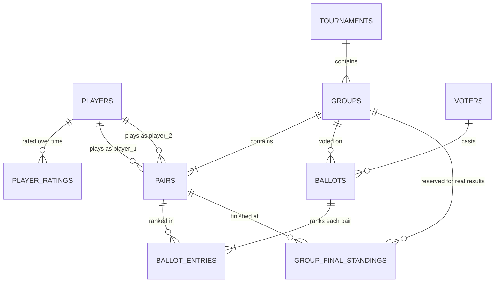

# Phase 1 Data Model: Group Standings Voting

**Date**: 2026-08-27 | **Plan**: [plan.md](./plan.md) | **Spec entities**: [spec.md](./spec.md#key-entities)

All timestamps are `timestamptz` stored in UTC and rendered in `Europe/Lisbon`. All tables have RLS
enabled with **no policies for the `anon` role** — access is exclusively through `packages/db` using
the service-role key (ADR-003).

## Entity relationships



## Tables

### `players` — one row per real person (FR-008)

| Column | Type | Notes |
|--------|------|-------|
| `id` | `uuid` PK | internal identifier, `default gen_random_uuid()` |
| `external_id` | `integer` UNIQUE NOT NULL | the ranking sheet's `ID` column — canonical identity (FR-004) |
| `display_name` | `text` NOT NULL | as published, e.g. `Rodrigo Da Costa` |
| `match_key` | `text` UNIQUE NOT NULL | NFC → case-folded → whitespace-collapsed name, e.g. `rodrigo da costa` |
| `club` | `text` NULL | most recently seen club |
| `created_at`, `updated_at` | `timestamptz` NOT NULL | |

- `match_key` is generated by `packages/core/matching`, never by SQL, so web and any future host
  normalise identically.
- The importer aborts if two source rows produce the same `match_key` (research F2 / ADR-007).

### `player_ratings` — dated rating snapshots from the sheet

| Column | Type | Notes |
|--------|------|-------|
| `player_id` | `uuid` FK → `players.id` ON DELETE CASCADE | |
| `rated_on` | `date` | parsed from the sheet's dated column headers (both `dd/mm/yyyy` and `dd-mm-yyyy` occur) |
| `points` | `integer` NOT NULL CHECK (`points >= 0`) | |
| PK | (`player_id`, `rated_on`) | re-running a sync is idempotent |

### `tournaments`

| Column | Type | Notes |
|--------|------|-------|
| `id` | `uuid` PK | |
| `name` | `text` NOT NULL | |
| `slug` | `text` UNIQUE NOT NULL | public URL key |
| `starts_at` | `timestamptz` NOT NULL | also the voting deadline (FR-011) |
| `published_at` | `timestamptz` NULL | NULL = draft, never publicly visible |
| `created_at` | `timestamptz` NOT NULL | |
| CHECK | `published_at IS NULL OR published_at < starts_at` | cannot publish a tournament already closed |

State is derived, never stored: `draft` (`published_at IS NULL`), `open`
(`published_at IS NOT NULL AND now() < starts_at`), `closed` (`now() >= starts_at`). The single
`window` module in `packages/core` owns this decision (Risk R5).

### `groups`

| Column | Type | Notes |
|--------|------|-------|
| `id` | `uuid` PK | |
| `tournament_id` | `uuid` FK → `tournaments.id` ON DELETE CASCADE | |
| `label` | `text` NOT NULL | e.g. `A`, `B` |
| `position` | `smallint` NOT NULL | 1-based display order |
| UNIQUE | (`tournament_id`, `label`), (`tournament_id`, `position`) | |

Group size is not stored; it is `count(pairs)`, validated at publish time to be between 3 and 6
(research D10).

### `pairs`

| Column | Type | Notes |
|--------|------|-------|
| `id` | `uuid` PK | |
| `group_id` | `uuid` FK → `groups.id` ON DELETE CASCADE | |
| `player_1_id`, `player_2_id` | `uuid` FK → `players.id` | |
| `club` | `text` NOT NULL | club represented in this tournament |
| `player_1_points`, `player_2_points` | `integer` NOT NULL | captured at publish time (FR-007) |
| `total_points` | `integer` NOT NULL | as supplied; validated to equal the sum |
| `seed` | `smallint` NOT NULL | 1-based rank within the group |
| UNIQUE | (`group_id`, `seed`) | |
| CHECK | `player_1_id <> player_2_id` | |

A player appearing in two pairs of the same tournament is rejected in `packages/core/lineup` before
insert (spec edge case); the constraint is not expressible per-tournament in SQL without a trigger,
and a trigger is not warranted at this scale.

### `voters` (ADR-004)

| Column | Type | Notes |
|--------|------|-------|
| `id` | `uuid` PK | value carried in the signed cookie |
| `created_at`, `last_seen_at` | `timestamptz` NOT NULL | |

`last_seen_at` is refreshed by the voter-cookie layer on each recognised request, through
`VoterRepository`. No IP, no user agent, no personal data (constitution: Privacy). Rate limiting
keys on a salted IP hash held outside Postgres with a 10-minute TTL and is never persisted here.

### `ballots` — one immutable ballot per voter per group (FR-013)

| Column | Type | Notes |
|--------|------|-------|
| `id` | `uuid` PK | |
| `group_id` | `uuid` FK → `groups.id` ON DELETE CASCADE | |
| `voter_id` | `uuid` FK → `voters.id` | |
| `cast_at` | `timestamptz` NOT NULL DEFAULT `now()` | |
| UNIQUE | (`group_id`, `voter_id`) | the concurrency guarantee behind SC-009 / Risk R7 |

No `updated_at`: ballots are insert-only (spec assumption).

### `ballot_entries` — one row per ranked pair (ADR-005)

| Column | Type | Notes |
|--------|------|-------|
| `ballot_id` | `uuid` FK → `ballots.id` ON DELETE CASCADE | |
| `pair_id` | `uuid` FK → `pairs.id` | |
| `position` | `smallint` NOT NULL CHECK (`position BETWEEN 1 AND 6`) | |
| PK | (`ballot_id`, `pair_id`) | a pair cannot be ranked twice |
| UNIQUE | (`ballot_id`, `position`) | a position cannot be reused (FR-010) |

Completeness (every pair in the group ranked, positions forming `1..n`) is validated in
`packages/core/ballot` and the whole ballot is inserted in one transaction, so a rejected ballot
leaves nothing behind.

### `group_final_standings` — reserved, unpopulated (FR-026)

| Column | Type | Notes |
|--------|------|-------|
| `group_id` | `uuid` FK → `groups.id` ON DELETE CASCADE | |
| `pair_id` | `uuid` FK → `pairs.id` | |
| `position` | `smallint` NOT NULL | |
| `recorded_at` | `timestamptz` NOT NULL DEFAULT `now()` | |
| PK | (`group_id`, `pair_id`) | |
| UNIQUE | (`group_id`, `position`) | |

Created by the initial migration and written by nothing in phase 1. No code reads it (Principle V).

## Derived read model

### View `group_position_counts`

```sql
CREATE VIEW group_position_counts AS
SELECT b.group_id,
       e.pair_id,
       e.position,
       count(*)::int AS votes
FROM ballot_entries e
JOIN ballots b ON b.id = e.ballot_id
GROUP BY b.group_id, e.pair_id, e.position;
```

Plus `group_ballot_counts` (`SELECT group_id, count(*) FROM ballots GROUP BY group_id`).

Percentages, mean predicted position, crowd ordering and tie-breaks are computed by
`packages/core/scoring` from these counts — not in SQL (ADR-006), so the formula is unit-testable and
identical on any future host.

### Scoring definition (authoritative)

For a group with `N` ballots and pairs `P`:

- `position_share(pair, p) = votes(pair, p) / N` — rendered as a percentage, rounded for display
  only, never rounded before ordering.
- `mean_position(pair) = Σ_p (p × votes(pair, p)) / N`.
- Crowd order: ascending `mean_position`; ties broken by descending `votes(pair, 1)`, then descending
  `total_points`, then ascending `pair.id` (FR-018, fully deterministic).
- `N = 0` → no results object is produced; the caller renders the explicit "no votes yet" state
  (FR-019). Division by zero is impossible by construction.

## Indexes

- `ballots (group_id)` — every aggregation path.
- `ballot_entries (pair_id)` — per-pair breakdowns.
- `pairs (group_id)`, `groups (tournament_id)` — page loads.
- `pairs (player_1_id)`, `pairs (player_2_id)` — player history (FR-025).
- `tournaments (published_at DESC)` — history list (FR-023).
- `players (match_key)`, `players (external_id)` — import path (already UNIQUE).

## Validation rules by origin

| Rule | Enforced in | Also enforced by |
|------|-------------|------------------|
| Ballot is a complete permutation of the group's pairs | `core/ballot` | PK + UNIQUE on `ballot_entries` |
| One ballot per voter per group | `core/api` handler | UNIQUE (`group_id`, `voter_id`) |
| Voting window open | `core/window` (server clock) | CHECK on `published_at < starts_at` |
| Player resolves to exactly one identity | `core/matching` | UNIQUE `match_key`, UNIQUE `external_id` |
| `total_points` equals the sum of both players' points | `core/lineup` | — |
| Group size between 3 and 6 | `core/lineup` | — |
| A player appears at most once per tournament | `core/lineup` | — |
