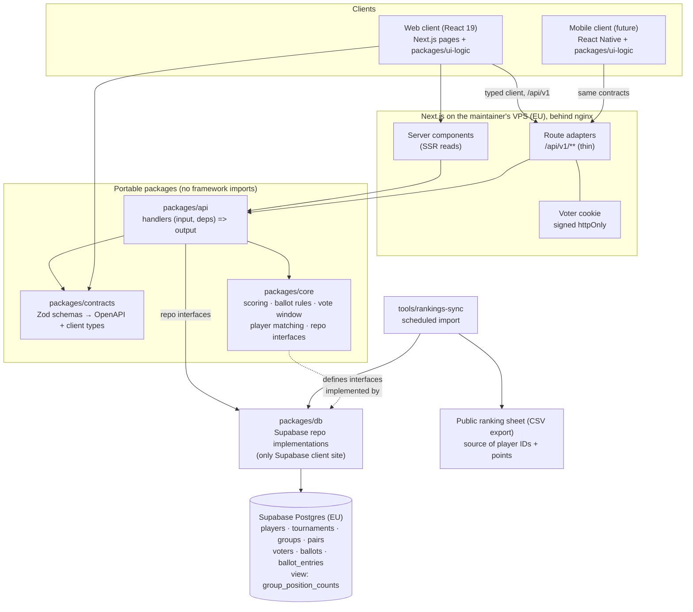

# Implementation Plan: Group Standings Voting

**Branch**: `001-group-standings-voting` | **Date**: 2026-08-27 | **Spec**: [spec.md](./spec.md)

**Input**: Feature specification from `/specs/001-group-standings-voting/spec.md`

## Summary

Deliver a public web app where an organiser publishes a padel tournament lineup as structured data,
visitors cast one ranked ballot (1st–6th) per group without signing in, and the crowd's predicted
standings are shown as per-position percentages ordered by average predicted position.

Technical approach: a TypeScript monorepo whose business logic lives in framework-free packages
(`packages/core`, `packages/api`, `packages/contracts`, `packages/ui-logic`) with Next.js acting only
as the current host — page rendering plus five-line `/api/v1` route adapters. Supabase Postgres is
the system of record, reached exclusively from the server through repository implementations in
`packages/db`; Row Level Security denies all anonymous direct access. Voter identity is a signed
httpOnly cookie. Aggregation runs as a Postgres view feeding a pure scoring function in
`packages/core`. A React Native client and a standalone API service are both reachable later by
swapping adapters, with zero changes to domain code.

## Technical Context

**Language/Version**: TypeScript 5.x, `strict: true`, Node 22 LTS runtime

**Primary Dependencies**: Next.js 15 (App Router, React 19) for web host; Zod for contracts and
validation; TanStack Query for client data fetching; `postgres` (postgres.js) as the sole
Postgres driver, confined to `packages/db`; `jose` for cookie signing; Tailwind for styling; Vitest + Playwright for tests;
`eslint-plugin-boundaries` + `dependency-cruiser` to enforce the import boundary

**Storage**: Supabase Postgres (EU region), schema as committed SQL migrations in
`supabase/migrations/`; no Supabase Storage or Realtime in phase 1

**Testing**: Vitest for unit and contract tests (100% branch coverage required on
`packages/core/{scoring,ballot,matching,window}`), Playwright for the two critical end-to-end flows
(publish a lineup; vote and reveal), pgTAP-style SQL assertions replaced by a migration smoke test
run against a scratch database in CI

**Target Platform**: mobile-first responsive web (iOS Safari, Android Chrome, desktop evergreen);
future React Native/Expo client consuming the same `/api/v1` contracts

**Project Type**: web application with an explicitly detachable API layer, structured as a monorepo

**Performance Goals**: p95 server response under 300 ms for read endpoints and under 500 ms for
ballot submission, measured in the EU region; results visible to the voter within 2 s of submission
(SC-005); tournament page interactive under 2.5 s on a mid-range phone over 4G

**Constraints**: no personal data beyond published player names and points; results must not leak
before a visitor votes (SC-006), which forbids CDN caching of any personalised response; vote-window
enforcement must use server time only (SC-007); single-maintainer operational budget — one deploy
target plus one managed database, no queues, workers, or caches

**Scale/Scope**: club-sized — tens of tournaments per year, 2–4 groups each, hundreds of ballots per
tournament, ~800 players in the ranking source, peak of a few hundred voters in a 10-minute window
(SC-009). Five public screens in phase 1 (landing list, tournament detail with voting and results, history, player) plus one organiser screen.

## Constitution Check

_GATE: Must pass before Phase 0 research. Re-check after Phase 1 design._

| Principle                               | Gate                                                                                                                     | How this design satisfies it                                                                                                                                                                                         | Status |
| --------------------------------------- | ------------------------------------------------------------------------------------------------------------------------ | -------------------------------------------------------------------------------------------------------------------------------------------------------------------------------------------------------------------- | ------ |
| I. Spec-Driven Delivery                 | Spec exists and precedes code                                                                                            | `spec.md` written and validated before this plan; no source files created yet                                                                                                                                        | PASS   |
| II. Portable Core, Thin Adapters        | No host/vendor imports in core; handlers are `(input, deps) => output`; single Supabase construction site                | Domain in `packages/core`; handlers in `packages/api`; Supabase client only in `packages/db`; shared hooks in `packages/ui-logic`; boundary enforced by `dependency-cruiser` rules run in CI, not by convention      | PASS   |
| III. Contract-First, Versioned API      | Zod schemas first, generated client, `/api/v1` prefix                                                                    | `packages/contracts` is authored before handlers and generates both the OpenAPI document and `packages/client`; every route lives under `/api/v1`                                                                    | PASS   |
| IV. Server-Authoritative Trust Boundary | Window, dedupe, validity, aggregation server-side; service-role key server-only; RLS deny-by-default; no ballot exposure | All writes go through route adapters using the service-role key held in server env; RLS grants the anon role nothing; the reveal gate is decided server-side per request and responses are `Cache-Control: no-store` | PASS   |
| V. Simplicity and YAGNI                 | Smallest viable design; new services justified                                                                           | One deploy target plus Supabase; no queue, cache, worker, or second service; aggregation is a plain SQL view; reserved-but-empty `group_final_standings` table carries no code                              | PASS   |

**Amendment 2026-08-27 (during implementation, per Principle I)**: the driver named above was
originally `@supabase/supabase-js`. It was replaced by `postgres` (postgres.js) before any
`packages/db` code was written, because PostgREST — the protocol `supabase-js` speaks — cannot open a
multi-statement transaction, and two design requirements are stated as transactions: publishing a
tournament inserts tournament + groups + pairs atomically (FR-007), and casting a ballot inserts the
ballot plus its entries atomically so a rejected ballot leaves nothing behind (FR-010). It also makes
`Cache-Control`-independent contract tests runnable against any scratch Postgres, which the
constitution's contract-test gate requires. Supabase Postgres remains the system of record and the
connection still goes through Supabase's pooler (Risk R8); the boundary is unchanged and tightened —
`packages/db` is the only module allowed to construct a database client, now enforced for `postgres`
as well as `@supabase/*`. See [ADR-003](../../docs/adr/ADR-003-supabase-postgres-server-only.md).

**Amendment 2026-08-28 (during implementation, per Principle I)**: the canonical player identity
moves from the ranking sheet's `ID` to the normalised name (`match_key`). The sheet's `ID` column is
not unique — 784 rows, 756 distinct values, 18 values shared by 46 rows describing different people —
and the sheet is maintained by a third party, so the club can neither correct it nor prevent the next
collision. While `external_id` is required to be unique, every import aborts and nothing can be
published at all. All 784 normalised names are distinct, so `match_key` is the only field in the
source that has ever identified a person.

No principle is weakened by this. Principle II is untouched: `packages/core/matching` already owns
normalisation and keeps owning it, and the change is confined to which key the importer upserts on.
Principle IV is untouched: identity is still decided server-side and the duplicate-key check still
aborts the whole import. The change is delivered as migration `0006` plus a repository change, with
the guard on `match_key` becoming load-bearing rather than merely defensive. The accepted cost is
that a rename on the sheet now splits a player in two, and that the explicit `externalId`
disambiguation escape hatch is gone; both are recorded in
[ADR-007](../../docs/adr/ADR-007-player-identity-ranking-sheet.md) § Amendment, whose "admin merge UI"
alternative is the eventual mitigation.

**Amendment 2026-08-28 (hosting, per Principle I)**: `apps/web` moves from Vercel to the
maintainer's existing VPS — built in CI, rsynced as a Next.js standalone bundle, run under systemd
behind nginx. Supabase EU is unchanged and remains the system of record, still through the pooler.

Principle V is the one to check here, and it is satisfied rather than strained: no new runtime
service is added, and the host already runs two services for this maintainer under exactly this
deploy idiom, so the third adds a unit file rather than a platform. ADR-010's original rejection of
self-hosting rested on backups, patching and TLS; the first does not apply once the database stays in
Supabase, and the other two are already sunk on that box. Principles I-IV are untouched: the host has
always been an adapter concern (ADR-002), and nothing in `packages/**` may reference it.

Two consequences are load-bearing at deploy time rather than optional. nginx MUST overwrite
`X-Forwarded-For` with `$remote_addr` rather than append to it, or the ballot rate limiter's key
becomes caller-controlled (Risk R2). And the pooler is now mandatory for a second, independent
reason: Supabase's direct endpoint is IPv6-only and CI runners are IPv4-only (Risk R8). See
[ADR-010](../../docs/adr/ADR-010-hosting-vercel-supabase.md) § Amendment.

**Post-design re-check (after Phase 1)**: PASS. Two items were reviewed and consciously kept:
`packages/client` is generated rather than hand-written (Principle III requires it), and aggregation
is split between a SQL view (counting) and a pure TypeScript function (percentages, ordering,
tie-breaks) so the formula stays unit-testable in `packages/core` per Principle II. Neither is a
deviation; the Complexity Tracking table is therefore empty.

## Architecture Overview



Detachment path, stated concretely so it stays true: moving to a standalone API service means
re-hosting `packages/api` behind Fastify (one file per route, same handler calls) and pointing
`packages/client` at the new base URL. Adding the mobile app means a new `apps/mobile` that imports
`packages/client` and `packages/ui-logic` unchanged. Neither touches `packages/core`.

## Key Architectural Decisions

Full records live in `docs/adr/`. Summary:

| ADR                                                                         | Decision                                                                          | Primary trade-off accepted                                                                      |
| --------------------------------------------------------------------------- | --------------------------------------------------------------------------------- | ----------------------------------------------------------------------------------------------- |
| [ADR-001](../../docs/adr/ADR-001-monorepo-portable-core.md)                 | Monorepo with portable core packages and thin host adapters                       | Monorepo tooling overhead now, in exchange for cheap web→mobile and Next→standalone moves later |
| [ADR-002](../../docs/adr/ADR-002-nextjs-route-handlers-as-api-host.md)      | Next.js route handlers host `/api/v1` in phase 1                                  | Mobile clients depend on the web app's deploy until the API is detached                         |
| [ADR-003](../../docs/adr/ADR-003-supabase-postgres-server-only.md)          | Supabase Postgres, reached only from the server; RLS denies anon                  | Loses Supabase's zero-backend convenience; every read needs a route                             |
| [ADR-004](../../docs/adr/ADR-004-anonymous-voter-cookie.md)                 | Signed httpOnly cookie as voter identity                                          | Private windows and cleared cookies vote again; no cross-device history                         |
| [ADR-005](../../docs/adr/ADR-005-normalised-ballot-entries.md)              | Ballots stored as one row per pair-position, not a JSON array                     | More rows and joins than a JSON blob, in exchange for DB-enforced validity and SQL aggregation  |
| [ADR-006](../../docs/adr/ADR-006-aggregation-sql-view-plus-pure-scoring.md) | Counting in a SQL view, percentages and ordering in a pure function               | Logic spans two places; the split keeps the formula unit-testable and the counting fast         |
| [ADR-007](../../docs/adr/ADR-007-player-identity-ranking-sheet.md)          | Ranking-sheet `ID` as canonical player identifier, normalised exact-name matching | Import fails loudly on any new or renamed player; no fuzzy convenience                          |
| [ADR-008](../../docs/adr/ADR-008-vote-to-reveal-gating.md)                  | Results gated server-side until the requester votes or voting closes              | No CDN caching of tournament responses; slightly higher server load                             |
| [ADR-009](../../docs/adr/ADR-009-testing-strategy.md)                       | Vitest unit + contract tests, 100% branch on core rules, 2 Playwright flows       | Coverage floor is a real constraint on core code; deliberately no floor elsewhere               |
| [ADR-010](../../docs/adr/ADR-010-hosting-vercel-supabase.md)                | Supabase EU; `apps/web` on the maintainer's VPS (amended 2026-08-28, was Vercel)  | One box is a single point of failure; no preview environments; the proxy must overwrite XFF     |

## Project Structure

### Documentation (this feature)

```text
specs/001-group-standings-voting/
├── plan.md              # This file
├── research.md          # Phase 0 output — decision log
├── data-model.md        # Phase 1 output — entities, schema, constraints
├── quickstart.md        # Phase 1 output — setup and validation guide
├── contracts/           # Phase 1 output — API contracts
│   ├── README.md
│   ├── openapi.yaml
│   └── lineup-payload.example.json
├── checklists/
│   └── requirements.md
└── tasks.md             # Created later by /speckit-tasks
```

### Source Code (repository root)

```text
apps/
└── web/                          # Next.js 15 host: the ONLY place Next.js appears
    ├── app/
    │   ├── (public)/             # tournament list, tournament detail, group vote, history, player
    │   ├── admin/                # organiser: paste payload → preview → publish
    │   └── api/v1/               # route adapters: parse → handler → respond
    │       ├── tournaments/
    │       ├── groups/[groupId]/{ballots,results}/
    │       ├── players/[playerId]/
    │       └── admin/{tournaments,rankings}/
    ├── components/               # platform-specific rendering only
    └── tests/e2e/                # Playwright: publish flow, vote-and-reveal flow

packages/
├── contracts/                    # Zod schemas → OpenAPI + client types (no runtime deps)
├── core/                         # domain — imports nothing from host or vendor
│   ├── scoring/                  # per-position %, average rank, crowd order, tie-breaks
│   ├── ballot/                   # permutation + membership validation
│   ├── window/                   # open/closed decision from server clock
│   ├── matching/                 # name normalisation + player resolution
│   ├── lineup/                   # payload → groups/pairs derivation
│   └── ports/                    # repository interfaces (implemented by packages/db)
├── api/                          # handlers: (input, deps) => Promise<output>
├── db/                           # Supabase repository implementations (only client site)
├── client/                       # generated typed HTTP client (fetch only)
└── ui-logic/                     # platform-free hooks/state shared with future mobile

supabase/
└── migrations/                   # committed SQL, applied in CI against a scratch DB

tools/
└── rankings-sync/                # pull public ranking CSV → upsert players + rating snapshots

docs/
└── adr/                          # ADR-001 … ADR-010
```

**Structure Decision**: monorepo (pnpm workspaces + Turborepo) with the four-layer split above.
`apps/web` is a host, not the application: it may import `packages/{contracts,client,ui-logic,api}`
but never reach past them into `packages/db`, and nothing in `packages/**` may import from `apps/**`.
`apps/mobile` is the intended second host and requires no new packages. This is the structure the
constitution's Principle II describes, and `dependency-cruiser` enforces it in CI rather than
relying on discipline.

## Complexity Tracking

> No Constitution Check violations. Table intentionally empty.

| Violation | Why Needed | Simpler Alternative Rejected Because |
| --------- | ---------- | ------------------------------------ |
| —         | —          | —                                    |

## Risks and Mitigations

| #   | Risk                                                                                            | Impact                                                  | Mitigation                                                                                                                                                                                                       |
| --- | ----------------------------------------------------------------------------------------------- | ------------------------------------------------------- | ---------------------------------------------------------------------------------------------------------------------------------------------------------------------------------------------------------------- |
| R1  | Results leak before a visitor votes (cached response, over-broad payload, or a debug field)     | Breaks the core game and SC-006                         | Reveal decided server-side per request; `Cache-Control: no-store` on tournament and results responses; the un-voted payload never contains counts; automated test per public read path                           |
| R2  | Cookie-based dedupe is trivially bypassed (private window, second device)                       | Ballot stuffing skews percentages                       | Accepted by spec; add per-IP rate limiting on ballot submission and record ballot counts so anomalies are visible; a Turnstile challenge is the pre-planned escalation if abuse appears                          |
| R3  | The public ranking sheet changes shape, gains duplicate names, or stops being publicly exported | Player import breaks; identity guessing risk            | Sync stores the raw CSV snapshot and fails loudly instead of guessing; duplicate-name check runs every import; last good snapshot serves imports meanwhile; organiser sees a staleness warning                   |
| R4  | Next.js coupling creeps into domain code, silently killing the detach path                      | The stated mobile/standalone-API plan becomes a rewrite | `dependency-cruiser` boundary rules in CI (Principle II); route adapters capped at parse/call/respond and reviewed as such                                                                                       |
| R5  | Lock-boundary bugs around the start instant (timezone, client clock)                            | Ballots accepted after close, violating SC-007          | `timestamptz` in UTC, server clock only, single `window` module in core with explicit tests at the boundary instant; client clock never consulted                                                                |
| R6  | Low ballot counts make percentages look authoritative when they are noise                       | Misleading headline numbers                             | Ballot count displayed wherever percentages appear (FR-019); explicit "no votes yet" state                                                                                                                       |
| R7  | Concurrent duplicate ballot submissions from one voter                                          | Double-counted ballots, SC-009 failure                  | `UNIQUE (group_id, voter_id)` plus a single-statement insert; the duplicate surfaces as a domain error, not a 500                                                                                                |
| R8  | Supabase free-tier pausing or connection limits under a voting spike                            | Site down at the exact moment it matters                | Connection pooling via Supabase's pooler; load-test the vote path at 3× expected peak before the first real tournament; upgrade tier is the accepted fix, not architecture change                                |
| R9  | Organiser paste-and-publish mistakes (wrong start time, wrong lineup)                           | Public tournament with bad data                         | Mandatory preview before publish (FR-002); start time must be in the future (FR-005); republish is a new tournament, and correcting a published one is an explicit organiser action, not an in-place silent edit |
| R10 | Image-based lineup ingestion (the deferred phase) arrives and does not fit                      | Rework of the publish path                              | The extractor is specified to plug in ahead of the existing preview step, producing the same payload shape; nothing downstream changes                                                                           |
